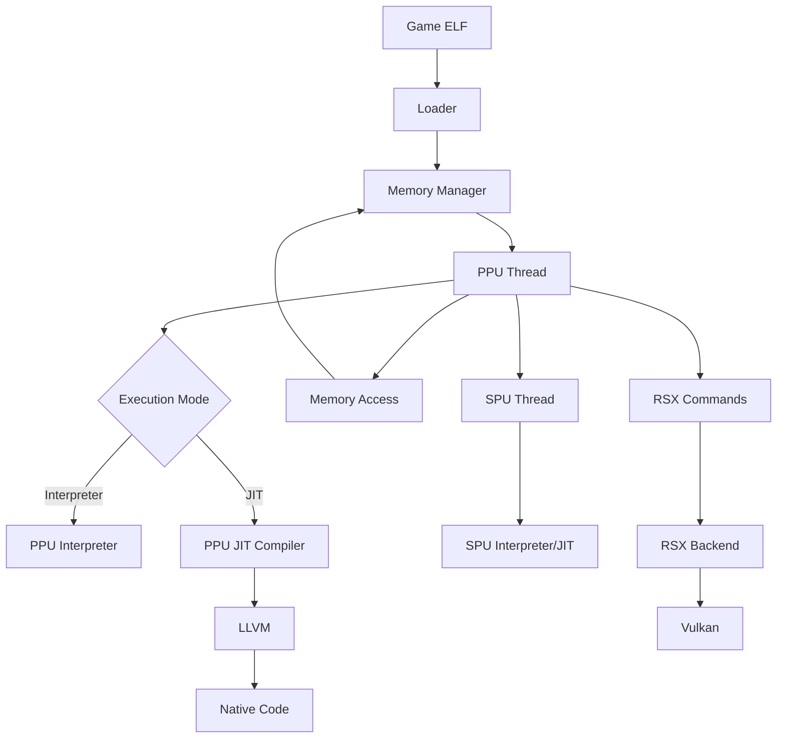

# System architecture

oxidized-cell uses a hybrid architecture combining Rust's memory safety with C++'s performance optimization capabilities. The emulator is split into two main components that work together through a Foreign Function Interface (FFI).

## Architecture overview

```
┌─────────────────────────────────────────────────────────────────┐
│                         oxidized-cell                            │
├─────────────────────────────────────────────────────────────────┤
│  ┌────────────────────────────────────────────────────────────┐ │
│  │                    Rust Core (~70%)                         │ │
│  │  ┌──────────┐ ┌──────────┐ ┌──────────┐ ┌──────────┐       │ │
│  │  │  Memory  │ │  Kernel  │ │  Thread  │ │   VFS    │       │ │
│  │  │  Manager │ │  (LV2)   │ │ Scheduler│ │          │       │ │
│  │  └──────────┘ └──────────┘ └──────────┘ └──────────┘       │ │
│  │  ┌──────────┐ ┌──────────┐ ┌──────────┐ ┌──────────┐       │ │
│  │  │   PPU    │ │   SPU    │ │   RSX    │ │  Audio   │       │ │
│  │  │Interpret.│ │Interpret.│ │ Backend  │ │  System  │       │ │
│  │  └──────────┘ └──────────┘ └──────────┘ └──────────┘       │ │
│  └────────────────────────────────────────────────────────────┘ │
│                              │ FFI (oc-ffi)                      │
│                              ▼                                   │
│  ┌────────────────────────────────────────────────────────────┐ │
│  │                 C++ Performance Core (~30%)                 │ │
│  │  ┌───────────────┐ ┌───────────────┐ ┌───────────────┐     │ │
│  │  │   PPU JIT     │ │   SPU JIT     │ │  RSX Shaders  │     │ │
│  │  │   (LLVM)      │ │   (LLVM)      │ │  (SPIRV)      │     │ │
│  │  └───────────────┘ └───────────────┘ └───────────────┘     │ │
│  │  ┌───────────────┐ ┌───────────────┐                        │ │
│  │  │    Atomics    │ │  SIMD (AVX)   │                        │ │
│  │  │   (128-byte)  │ │   Helpers     │                        │ │
│  │  └───────────────┘ └───────────────┘                        │ │
│  └────────────────────────────────────────────────────────────┘ │
└─────────────────────────────────────────────────────────────────┘
```

## Rust core components

The Rust core provides the foundation of the emulator with safe, maintainable code:

### Memory management (oc-memory)

- **4GB virtual address space** emulation with 32-bit addressing
- **Page-based allocation** using 4KB pages with protection flags
- **Reservation system** for SPU atomics (128-byte granularity)
- **RSX memory mapping** between main memory and VRAM
- **Shared memory regions** between PPU and SPU threads

See [Memory model](/concepts/memory-model) for details.

### CPU emulation

- **PPU interpreter** (`oc-ppu`): Full PowerPC 64-bit instruction set with 2,700+ lines of implementation
- **SPU interpreter** (`oc-spu`): Complete SIMD instruction set with 128x128-bit registers
- **Thread management**: Scheduling, priorities, and affinity control
- **Exception handling**: Full exception model for both PPU and SPU

See [Cell Broadband Engine](/concepts/cell-be) for architecture details.

### System services

<CardGroup cols={2}>
  <Card title="LV2 kernel" icon="microchip">
    Process/thread management, synchronization primitives (mutex, semaphore, condition variables), memory allocation syscalls
  </Card>
  
  <Card title="Virtual file system" icon="folder">
    ISO 9660, PKG, PARAM.SFO support for game files and system data
  </Card>
  
  <Card title="Audio system" icon="volume">
    8 audio ports with 48kHz sample rate using cpal backend
  </Card>
  
  <Card title="Input system" icon="gamepad">
    Controller, keyboard, and mouse emulation with customizable mappings
  </Card>
</CardGroup>

### Graphics (oc-rsx)

- **Vulkan backend**: Modern GPU API for cross-platform rendering
- **NV4097 methods**: PS3 graphics command handling
- **Vertex attributes**: 16 attributes, 16 texture units
- **State management**: Blend, depth, stencil operations

## C++ performance components

The C++ layer provides performance-critical optimizations:

### JIT compilation (LLVM)

<Note>
  JIT compilation provides 10-100x speedup over pure interpretation for hot code paths.
</Note>

**PPU JIT** (`ppu_jit.cpp`):
- Basic block compilation with LLVM IR generation
- Branch prediction hints for optimized control flow
- Inline caching for function calls
- Code cache with LRU eviction (64MB default)
- Block linking for direct jumps between compiled blocks
- Trace compilation for hot loops

**SPU JIT** (`spu_jit.cpp`):
- SIMD optimization using LLVM vectorization
- Channel operations compiled inline
- MFC DMA operations for efficient memory transfers
- Loop optimization for hot SPU loops

See [Execution modes](/concepts/execution-modes) for interpreter vs JIT trade-offs.

### SIMD acceleration

- **AVX intrinsics** (`simd_avx.cpp`): Host SIMD for SPU vector operations
- **128-byte atomics** (`atomics.cpp`): Cache-line atomics for SPU synchronization

### Shader compilation

- **SPIR-V generation** (`rsx_shaders.cpp`): Convert PS3 vertex/fragment programs to Vulkan shaders

## FFI bridge (oc-ffi)

The FFI layer connects Rust and C++ components:

```rust
// Rust side: oc-ffi/src/jit.rs
pub struct PpuJitCompiler {
    // Opaque pointer to C++ JIT compiler
    inner: *mut std::ffi::c_void,
}

impl PpuJitCompiler {
    pub fn compile(&mut self, address: u32, code: &[u8]) -> Result<(), JitError> {
        // Call into C++ JIT compiler
    }
    
    pub fn execute(&mut self, ctx: &mut PpuContext, pc: u32) -> Result<u32, PpuExitReason> {
        // Execute JIT-compiled code
    }
}
```

```cpp
// C++ side: cpp/src/ppu_jit.cpp
struct PpuJitCompiler {
    CodeCache cache;
    BranchPredictor predictor;
    BlockLinker linker;
    
    bool compile(uint32_t address, const uint8_t* code, size_t len);
    uint32_t execute(PpuContext* ctx, uint32_t pc);
};
```

## Design principles

### Safety first, performance second

- **Rust for safety**: Memory management, core logic, and system services
- **C++ for performance**: JIT compilation and hot paths only
- **FFI boundaries**: Minimal and well-defined

### Modularity

Each crate has a single responsibility:

- `oc-memory`: Only memory management
- `oc-ppu`: Only PPU emulation
- `oc-spu`: Only SPU emulation
- `oc-rsx`: Only graphics
- `oc-lv2`: Only kernel syscalls

This makes the codebase easier to understand, test, and maintain.

### Performance where it matters

<Info>
  The interpreter is always available as a fallback, even when JIT compilation is enabled.
</Info>

The hybrid architecture provides:
- **Fast startup**: Interpreter runs immediately
- **Hot code optimization**: JIT compiles frequently executed code
- **Debugging support**: Interpreter provides accurate state for debugging

## Component interaction



## Project structure

The source code is organized as follows:

```
oxidized-cell/
├── crates/              # Rust crates
│   ├── oc-core/        # Core emulator types, config, logging
│   ├── oc-memory/      # Memory management
│   ├── oc-ppu/         # PPU interpreter & thread
│   ├── oc-spu/         # SPU interpreter & thread
│   ├── oc-rsx/         # RSX graphics backend
│   ├── oc-lv2/         # LV2 kernel syscalls
│   ├── oc-audio/       # Audio system
│   ├── oc-input/       # Input handling
│   ├── oc-vfs/         # Virtual file system
│   ├── oc-hle/         # HLE modules (cellGcmSys, etc.)
│   ├── oc-loader/      # ELF/SELF/PRX loader
│   ├── oc-ffi/         # Rust/C++ FFI bridge
│   ├── oc-ui/          # egui user interface
│   └── oc-integration/ # Integration & runner
├── cpp/                 # C++ performance components
│   ├── src/
│   │   ├── ppu_jit.cpp       # PPU JIT compiler
│   │   ├── spu_jit.cpp       # SPU JIT compiler
│   │   ├── rsx_shaders.cpp   # Shader compilation
│   │   ├── atomics.cpp       # 128-byte atomics
│   │   └── simd_avx.cpp      # AVX helpers
│   └── include/
│       └── oc_ffi.h          # FFI interface
└── src/                 # Main binary
```

## Configuration

The architecture supports runtime configuration through `config.toml`:

```toml
[cpu]
ppu_decoder = "interpreter"  # or "recompiler"
spu_decoder = "interpreter"  # or "recompiler"
ppu_threads = 2
spu_threads = 6

[gpu]
backend = "vulkan"
resolution_scale = 100

[audio]
enable = true
volume = 1.0
```

## Next steps

<CardGroup cols={2}>
  <Card title="Cell BE architecture" icon="cpu" href="/concepts/cell-be">
    Learn about the PPU and SPU processors
  </Card>
  
  <Card title="Memory model" icon="memory" href="/concepts/memory-model">
    Understand virtual address space and paging
  </Card>
  
  <Card title="Execution modes" icon="bolt" href="/concepts/execution-modes">
    Interpreter vs JIT compilation trade-offs
  </Card>
</CardGroup>
